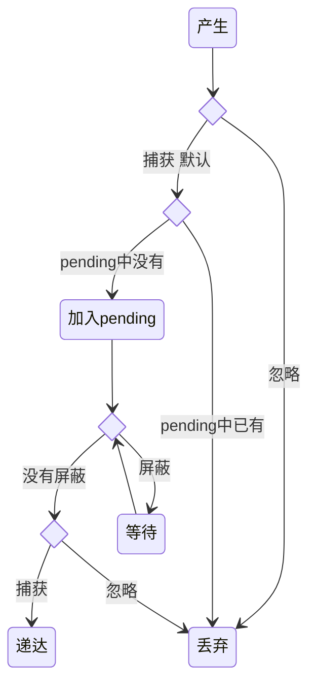
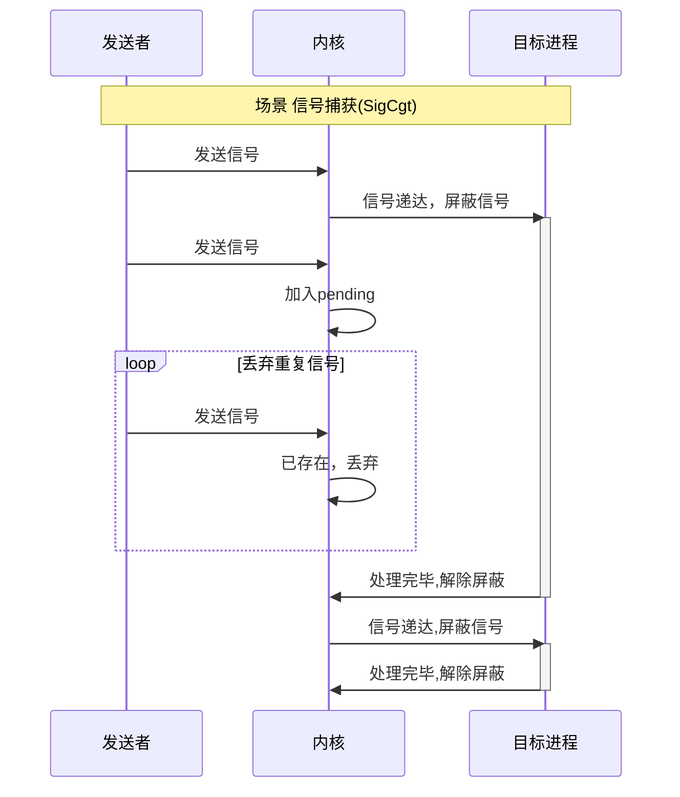
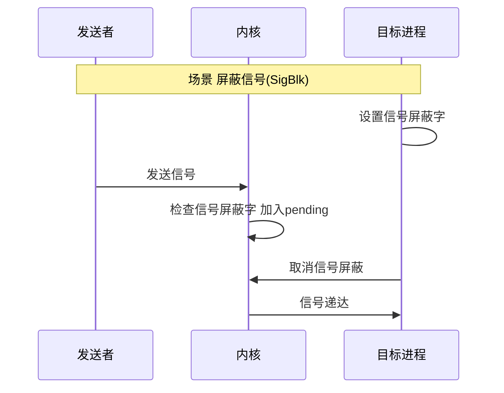
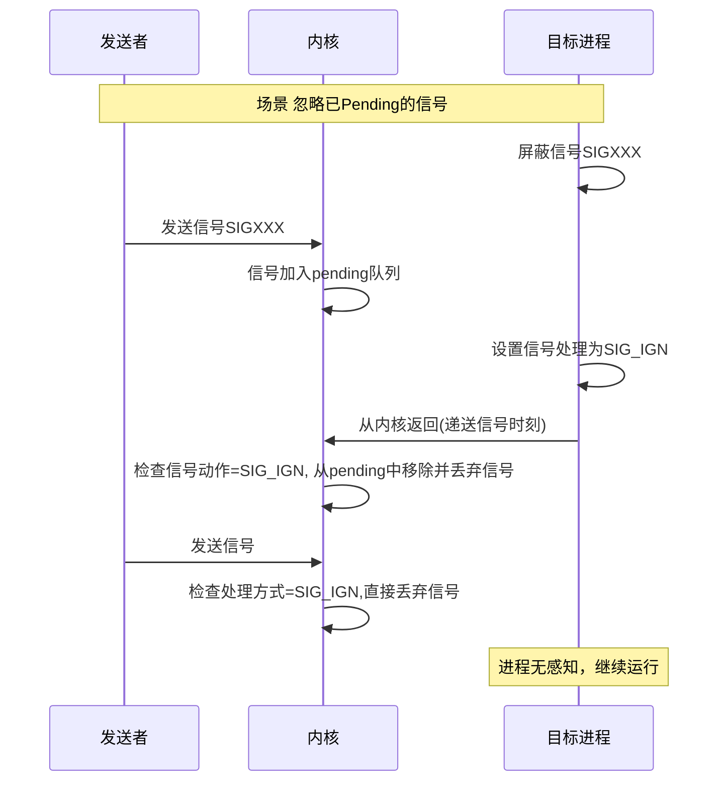

## 信号基础:什么是信号？

POSIX可靠信号(reliable signals)常称为 “标准信号”(standard signals).

> 请注意区分**POSIX可靠信号**和广泛传播的社区术语的**可靠信号**，社区术语中常将**标准信号**称为**不可靠信号**，将**实时信号**称为**可靠信号**，为避免混淆，本文仅使用术语**标准信号**和**实时信号**.
{: .prompt-tip }

信号是Linux系统中进程间通信的基本机制，用于通知进程发生了某种事件。比如按下Ctrl+C会发送SIGINT信号，kill命令默认发送SIGTERM信号。

理解信号，关键在于把握其从‘产生’到‘递达’的完整生命周期，以及进程在此过程中可以采取的不同处理策略。

### 信号的状态与生命周期

每个信号都经历一个标准的生命周期，通常包含以下三个核心状态:

- ​产生(Generated)​​:信号事件发生(如kill命令、硬件异常)
- ​未决(Pending)​​:信号已产生但尚未递送给进程(通常因被屏蔽)具体而言指进程的`ShdPnd`或`SigPnd`字段的对应位被置位
- ​递送(Delivered)​​:信号被实际传递给目标进程，执行对应的信号处理程序

> 实际执行信号的处理动作称为信号递达(Delivery)
>
> 信号从产生到递达之间的状态，称为信号未决(Pending)。
{: .prompt-tip }



### 标准信号的基本特性

- **异步到达**: 信号可能在程序执行的任何时刻到达
- **独立栈帧**: 每个信号处理程序拥有独立的栈帧
- **默认动作**: 每一个信号都有默认的处理动作，`man 7 signal`中有详细描述。
- **信号捕获**: 进程为信号安装一个处理函数，当信号递送时，调用该函数,详见[信号捕获](#信号捕获)
- **信号屏蔽**: 信号可以被屏蔽,被屏蔽信号,详见[信号屏蔽](#信号屏蔽)
- **信号忽略**: 信号可以被忽略,被忽略的信号,详见[信号忽略](#信号忽略)
- **信号重入**: 信号处理程序可以被另一个信号的处理程序打断，除非它相对于信号原子,详见异步信号安全
- **特殊信号**: 信号`SIGKILL`和`SIGSTOP`不能被捕获,屏蔽或忽略
- **处理时机**: 信号的处理发生在进程从内核态返回到用户态的时刻。这通常发生在以下几种情况之后:系统调用完成、中断处理结束、或进程被调度器选中重新投入运行。
- **信号冻结**: `STOP`状态的进程会“冻结”除`SIGCONT`和`SIGKILL`所有其他信号的处理，直到进程恢复运行。
- **非排队性**: 标准信号不支持排队。对于同一个标准信号，如果已处于未决状态，后续产生的实例会被直接丢弃，内核保证同一时刻最多只有一个实例等待处理，因此无法用于可靠的事件计数。

## 标准信号行为

在`/proc/[pid]/status`中可以查看进程的多项属性，本文我们关注以下属性:

1. 进程信号掩码

    - `ShdPnd` : 进程共享信号
    - `SigPnd` : 线程私有信号
    - `SigBlk` : 屏蔽的信号
    - `SigIgn` : 忽略的信号
    - `SigCgt` : 捕获的信号(安装了对应信号处理函数)

    进程信号掩码使用**位图(bitmap)**表示，每个信号对应一个比特位(从1开始编号)，字段以十六进制格式输出，关于信号的具体编号，参见`man 7 signal`.

2. 进程状态代码

    以下是 s、stat 和 state 输出说明符(标题为 “STAT” 或 “S”)将显示的用于描述进程状态的不同值:

    - `D` 不可中断睡眠(通常为 IO)
    - `I` 空闲内核线程
    - `R` 正在运行或可运行(在运行队列中)
    - `S` 可中断睡眠(等待事件完成)
    - `T` 被作业控制信号停止
    - `t` 在跟踪期间被调试器停止
    - `W` 分页(自 2.6.xx 内核起无效)
    - `X` 已死亡(不应被看到)
    - `Z` 僵死(“僵尸”)进程，已终止但未被其父进程回收

    对于 BSD 格式以及使用 stat 关键字时，可能会显示额外字符:

    - `<` 高优先级(对其他用户不友好)
    - `N` 低优先级(对其他用户友好)
    - `L` 有页面被锁定在内存中(用于实时和自定义 IO)
    - `s` 是会话领导者
    - `l` 是多线程的(使用 CLONE_THREAD，如 NPTL 线程所做的那样)
    - `+` 位于前台进程组中

信号对进程的干预，主要体现在为其配置不同的处理方式。以下是几种核心行为

### 信号捕获

进程可以调用`signal`或`sigaction`为每种信号安装对应的信号处理函数.

**不推荐**:使用`signal()`

```C
#include <signal.h>

void handle(int)  { /* ... */ }

int main() {
    signal(SIGALRM, handle);
}
```

> `signal()` 的行为在不同的 UNIX 版本中存在差异，并且在 Linux 的不同历史版本中也有所不同。应**避免使用它**，而改用 `sigaction`。
>
>`signal()` 唯一可移植的用法是将信号的处理方式设置为 `SIG_DFL` 或 `SIG_IGN`。
{: .prompt-warning }

**推荐**:使用 `sigaction()`

```C
struct sigaction {
   void     (*sa_handler)(int);
   void     (*sa_sigaction)(int, siginfo_t *, void *);
   sigset_t sa_mask;
   int      sa_flags;
};

int sigaction(int signum,
              const struct sigaction *_Nullable restrict act,
              struct sigaction *_Nullable restrict oldact);
```

在 `sa_flags` 中指定 `SA_SIGINFO`，`sa_sigaction`（而非 `sa_handler`）将为 `signum` 指定信号处理函数。

> 在某些架构中会涉及到联合体：不要同时给 `sa_handler` 和 `sa_sigaction` 赋值。
{: .prompt-warning }

`sa_mask` 指定了在信号处理程序执行期间应被阻塞的信号掩码（即，添加到调用该信号处理程序的线程的信号掩码中）。此外，触发该处理程序的信号也会被阻塞，除非使用了 `SA_NODEFER` 标志。

> 参见下文[信号屏蔽](#信号屏蔽)
{: .prompt-tip }

```C
#include <signal.h>
#include <stdio.h>
#include <stdlib.h>

void handler(int sig, siginfo_t *info, void *ucontext) { /* ... */ }

int main(void) {
    struct sigaction act;
    act.sa_sigaction = &handler;
    if (sigemptyset(&act.sa_mask) == -1) {
        perror("sigemptyset");
        exit(EXIT_FAILURE);
    }
    act.sa_flags = SA_SIGINFO;
    if (sigaction(SIGALRM, &act, NULL) == -1) {
        perror("sigaction");
        exit(EXIT_FAILURE);
    }
}
```

> 更多高级特性可通过`man sigaction`查看。
{: .prompt-tip }

**关键特性**:

- 处理信号期间，后续相同信号会被屏蔽,除非启用`SA_NODEFER`标签
- 被屏蔽的信号进入pending对立(最多保留一个实例)
- 处理完成后，pending中的信号会被立即递送
- 通过观察`/proc/[pid]/status`可以观察到`SigCgt`字段的对应位被置位
- 以`SIG_DFL`作为信号处理程序安装可以恢复到默认，通过观察`/proc/[pid]/status`可以观察到`SigCgt`字段的对应位被复位



附录[信号捕捉验证程序与操作流程](#信号捕捉验证程序与操作流程)提供了程序和操作流程可观察到上述特性。

### 信号屏蔽

单线程程序通过调用 `sigprocmask` 获取和/或更改调用线程的信号掩码。

> 在多线程程序中，`sigprocmask` 的使用是未定义的.
{: .prompt-warning }

```c
int sigprocmask(int how, const sigset_t *_Nullable restrict set, sigset_t *_Nullable restrict oldset);
```

调用的行为取决于 `how` 的值，具体如下。

- `SIG_BLOCK`: 阻塞信号集是当前信号集与参数信号集的并集。
- `SIG_UNBLOCK` : 参数信号集中的信号会从当前阻塞信号集中移除。尝试解除一个未被阻塞的信号的阻塞是允许的。
- `SIG_SETMASK` : 阻塞信号集被设置为参数信号集。

如果 `oldset` 不为 `NULL` ，则信号掩码的先前值会存储在 `oldset` 中。

设置信号集相关API:

- `int sigemptyset(sigset_t *set)` : 初始化信号集为空
- `int sigfillset(sigset_t *set)` : 初始化信号集为满(包含所有信号)
- `int sigaddset(sigset_t *set, int signum)` : 增加信号到信号集
- `int sigdelset(sigset_t *set, int signum)` : 从信号集删除信号
- `int sigismember(const sigset_t *set, int signum)` : 测试信号是否在信号集内

以下是一个简易的示例程序:

```C
#include <signal.h>

int main() {
    sigset_t set;
    if (sigemptyset(&set) == -1) {
        perror("sigemptyset");
        exit(EXIT_FAILURE);
    }
    if (sigaddset(&set, SIGALRM) == -1) {
        perror("sigaddset");
        exit(EXIT_FAILURE);
    }
    if (sigprocmask(SIG_BLOCK, &set, NULL) == -1) {
        perror("sigprocmask");
        exit(EXIT_FAILURE);
    }
}
```

1. 信号可以设置为屏蔽,被屏蔽的信号会被标记为未决(Pending),不会立即递送,直到解除屏蔽.
2. 标准信号不支持排队，连续发送多个相同信号，pending中只保留最早的的信号。
3. 解除屏蔽后，内核会检查pending队列并递送待处理信号



附录[信号屏蔽验证程序与操作流程](#信号屏蔽验证程序与操作流程)提供了程序和操作流程可观察到上述特性。

### 信号忽略

设置信号处理程序为`SIG_IGN`的信号会被内核直接丢弃，不会唤醒进程。

很多文章里会说,设置信号处理程序为`SIG_IGN`等价于设置为一个空函数,实际上它们有本质区别:

- 被忽略的信号不会被内核递送
- 不会唤醒睡眠进程和执行信号处理程序.

若一个信号已经在加入了pending，此时设置对应的信号处理为忽略`SIG_IGN`会发生什么？

标准规定：如果一个信号在处理动作被设置为`SIG_IGN`时正处于未决（Pending）状态，那么当它最终被递达（Delivery）时，内核会检查其当前动作，并因动作为`SIG_IGN`而将其直接丢弃。



附录[信号忽略验证程序与操作流程](#信号忽略验证程序与操作流程)提供了程序和操作流程可观察到上述特性。

## 本章小结

本章介绍了标准信号的基础概念，核心内容包括:

- **信号的本质**:一种异步进程间通信机制，具备特定的生命周期（产生、未决、递达）。
- **信号的基本特性**:包括**异步到达** **独立栈帧** **默认动作** **信号捕获** **信号屏蔽** **信号忽略** **信号重入** **特殊信号** **处理时机** **信号冻结** **非排队性**。
- **三种核心处理方式**:
  - **捕获**:通过`sigaction`安装自定义处理函数或恢复为默认处理。
  - **忽略**:使用`SIG_IGN`，信号将被内核直接丢弃。
  - **屏蔽**:使用`sigprocmask`设置信号的屏蔽。
- **观察方法**:可通过`/proc/[pid]/status`中的位图观察进程的信号状态。

## 附录

### 信号捕捉验证程序与操作流程

点击[SigCgt.c](/code/signal/SigCgt.c)获取信号捕捉验证程序.

```bash
# 会话1:运行程序
$ ./SigCgt
Before installing a signal handle, press any key to continue...>
# 会话2:检查进程状态
$ ps  -o pid,tid,stat,pending,blocked,ignored,caught  -p $(pgrep -x "SigCgt")
    PID     TID STAT          PENDING          BLOCKED          IGNORED           CAUGHT
 347844  347844 S+   0000000000000000 0000000000000000 0000000000000000 0000000000002000
# 会话1:继续程序(按Enter)
Install a signal handle for SIGALRM.
# 会话2:检查进程状态
$ ps  -o pid,tid,stat,pending,blocked,ignored,caught  -p $(pgrep -x "SigCgt")
    PID     TID STAT          PENDING          BLOCKED          IGNORED           CAUGHT
 347844  347844 S+   0000000000000000 0000000000000000 0000000000000000 0000000000002000
# 会话2:发送信号
$ kill -SIGALRM  $(pgrep -x "SigCgt")
# 会话1
enter handler, press Ctrl+D continue.
# 会话2:检查进程状态 信号SIGALRM屏蔽
$ ps  -o pid,tid,stat,pending,blocked,ignored,caught  -p $(pgrep -x "SigCgt")
    PID     TID STAT          PENDING          BLOCKED          IGNORED           CAUGHT
 347844  347844 S+   0000000000000000 0000000000002000 0000000000000000 0000000000002000
# 会话2:在处理信号期间再次发送信号
$ kill -SIGALRM  $(pgrep -x "SigCgt")
$ kill -SIGALRM  $(pgrep -x "SigCgt")
# 会话2:检查进程状态 信号SIGALRM进入pending
$ ps  -o pid,tid,stat,pending,blocked,ignored,caught  -p $(pgrep -x "SigCgt")
    PID     TID STAT          PENDING          BLOCKED          IGNORED           CAUGHT
 347844  347844 S+   0000000000002000 0000000000002000 0000000000000000 0000000000002000
# 会话1:继续程序(按Ctrl+D)结束当前信号处理，开始处理pending中的信号
enter handler, press Ctrl+D continue.
# 会话2:检查进程状态 处理pending信号
$ ps  -o pid,tid,stat,pending,blocked,ignored,caught  -p $(pgrep -x "SigCgt")
    PID     TID STAT          PENDING          BLOCKED          IGNORED           CAUGHT
 349248  349248 S+   0000000000000000 0000000000002000 0000000000000000 0000000000002000
# 会话1:继续程序(按Ctrl+D)结束信号处理
Install a default signal handle for SIGALRM.
press enter to quit...>
# 会话2:检查进程状态 信号处理完毕解除屏蔽,信号处理程序设置为默认，CAUGHT字段对应位复位
$ ps  -o pid,tid,stat,pending,blocked,ignored,caught  -p $(pgrep -x "SigCgt")
    PID     TID STAT          PENDING          BLOCKED          IGNORED           CAUGHT
 349248  349248 S+   0000000000000000 0000000000000000 0000000000000000 0000000000000000
# 会话1:继续程序(按Enter)结束程序
```

### 信号屏蔽验证程序与操作流程

点击[SigBlk.c](/code/signal/SigBlk.c)获取信号屏蔽验证程序.

```bash
# 会话1:运行程序
$ ./SigBlk
SIGALRM block.
You can try sending the SIGALRM signal and observe the process status.
Press enter to continue...>
# 会话2:检查进程状态(第一次)
$ ps -o pid,tid,stat,pending,blocked,ignored,caught -p $(pgrep -x "SigBlk")
    PID     TID STAT          PENDING          BLOCKED          IGNORED           CAUGHT
 374826  374826 S+   0000000000000000 0000000000002000 0000000000000000 0000000000002000
# 会话2:发送SIGALRM信号
$ kill -SIGALRM $(pgrep -x "SigBlk")
# 会话2:检查进程状态(第二次)
$ ps -o pid,tid,stat,pending,blocked,ignored,caught -p $(pgrep -x "SigBlk")
    PID     TID STAT          PENDING          BLOCKED          IGNORED           CAUGHT
 374826  374826 S+   0000000000002000 0000000000002000 0000000000000000 0000000000002000
# 会话1:继续程序(按Enter)
SIGALRM unblock.
press enter to quit
# 会话2:检查进程状态(第三次)
$ ps -o pid,tid,stat,pending,blocked,ignored,caught -p $(pgrep -x "SigBlk")
    PID     TID STAT          PENDING          BLOCKED          IGNORED           CAUGHT
 376571  376571 S+   0000000000000000 0000000000000000 0000000000000000 0000000000002000
# 会话1:继续程序(按Enter结束)
```

### 信号忽略验证程序与操作流程

点击[SigIgn.c](/code/signal/SigIgn.c)获取信号忽略验证程序.

```bash
# 会话1:运行程序
$ ./SigIgn
Install a signal handle for SIGUSR1.
# 会话2:发送多次SIGUSR1信号
$ kill -SIGUSR1 $(pgrep -x "SigIgn")
$ kill -SIGUSR1 $(pgrep -x "SigIgn")
# 会话1:继续程序(按Ctrl+D)结束当前信号处理,观察到只处理了一个信号
Set the SIGUSR1 signal handling method to ignore., press Ctrl+D continue.
press Ctrl+C to quit
# 会话2:发送多次SIGUSR1信号,
$ kill -SIGUSR1 $(pgrep -x "SigIgn")
# 会话2:检查进程状态 观察到程序没有被唤醒，依旧睡眠，也没有信号进入pending。
 ps  -o pid,tid,stat,pending,blocked,ignored,caught  -p $(pgrep -x "SigIgn")
    PID     TID STAT          PENDING          BLOCKED          IGNORED           CAUGHT
 345660  345660 S+   0000000000000000 0000000000000000  0000000000000200 0000000000000000
# 会话1:继续程序(按Ctrl+C结束)
```

## see also
