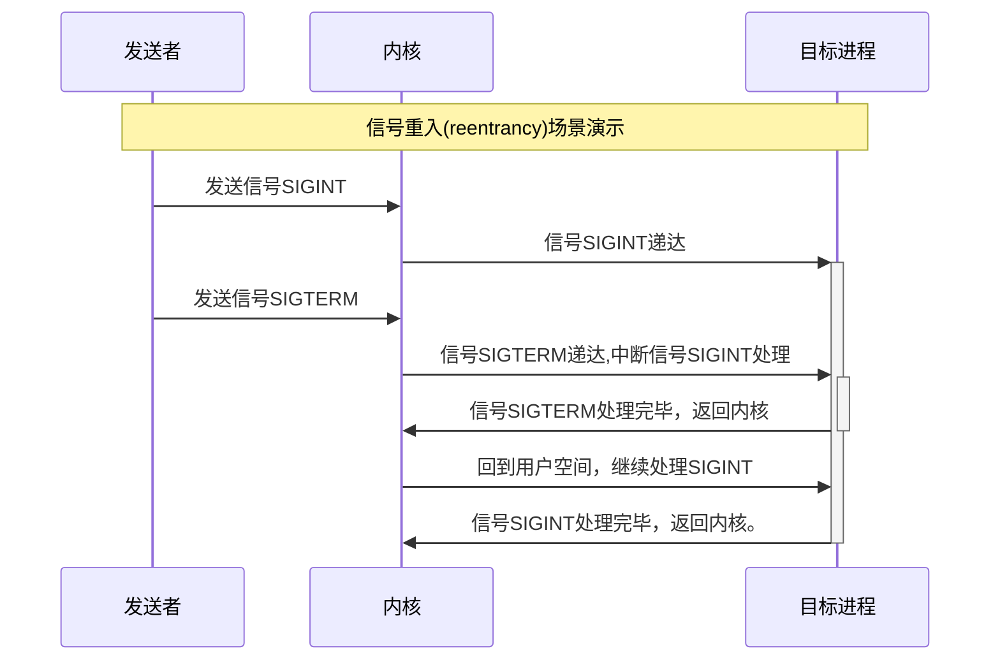
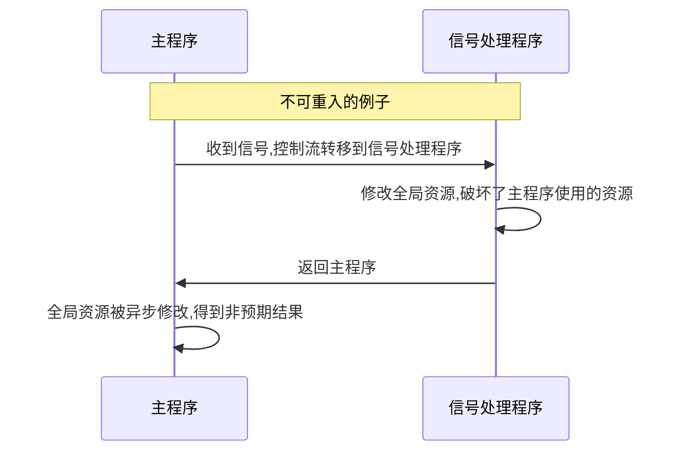
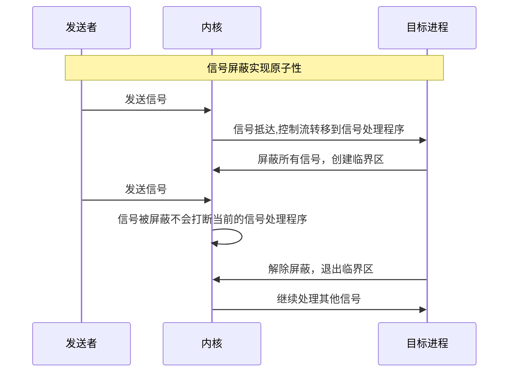

本章将深入探讨异步带来的风险，并系统性地介绍如何编写**异步信号安全**的信号处理程序，确保程序的稳定性和正确性。

---

## 为什么信号处理是危险的？

信号处理程序面临的核心挑战源于其**异步性**。这种特性虽然提供了灵活性，但也带来了安全隐患。

信号处理程序的异步性体现在两个层面：

1. **可能在任何时间点打断主程序的执行**
2. **可能被其他信号打断，形成"信号重入"**



**信号重入(Reentrancy)** 是指当进程正在执行一个信号处理函数时，又收到另一个信号并被内核递送，导致当前信号处理被中断并执行新信号处理函数的行为。

这种重入行为在以下情况下会变得特别危险：

- 启用`SA_NODEFER`标志时，甚至可能被**自身实例**重入
- 处理程序与主程序或其他信号处理程序**共享状态**（如全局变量）

当信号处理程序实现不当时，重入可能引发：

- **数据竞争**：多个执行流同时修改共享数据
- **状态不一致**：关键数据在操作过程中被意外修改
- **死锁**：资源锁被错误地重复获取

附录[信号重入验证程序与操作流程](#信号重入验证程序与操作流程)提供了程序和操作流程可观察到上述特性。

正是由于信号处理程序在执行时可能被重入，若其实现不当（如修改了全局状态），重入的发生将破坏其自身的执行环境，从而导致不可预知的后果。为避免此风险，必须谨慎实现信号处理函数。

## 异步信号安全函数 async-signal-safe function

一个函数或程序块是**异步信号安全的**，意味着它可以在信号处理程序中安全调用，而不会引起上述问题。POSIX 标准通过两种方式保证安全性：

1. **可重入性**：函数本身不依赖或修改任何共享状态。
2. **原子性**：函数的执行不会被信号中断，或通过信号屏蔽等机制保护了临界区。

> **核心规范**：在编写信号处理程序时，应严格遵循 POSIX 规定的异步信号安全函数列表（可通过 `man 7 signal-safety` 查看）。违反此规则是大多数信号相关 Bug 的根源。
{: .prompt-tip }

在理想情况下，信号处理程序应避免访问全局变量，但如果必须访问，则需通过原子操作或简单操作来实现可重入性。

## 方案一：编写可重入的处理程序

若一个函数是可重入的，则该函数应当满足下述条件：

- 不能使用或返回静态（全局）非常量数据
- 只能处理由调用者提供的数据。
- 不能依赖于单例模式资源的锁。
- 调用（call）的函数也必需是可重入的。

可重入函数核心在于当由于中断和信号等主程序被打断，中断或信号处理程序异步地执行后不破坏主程序或处理程序的上下文.

寄存器和帧栈上下文会由操作系统保存和回复,这里主要指不影响静态（全局）数据。

> C标准库I/O函数都不可重入.
{: .prompt-warning }



## 方案二：通过原子性确保安全

当处理逻辑必须访问共享资源时，可重入性难以保证。此时，可以通过原子性来保证安全。原子性操作可以分为两个层次：

### 使用 `sig_atomic_t` 进行简单标志操作

POSIX定义了`sig_atomic_t`类型，用于在信号处理程序和主程序之间安全地通信简单状态。根据POSIX标准：

`sig_atomic_t`是一种可以被原子性访问的整数类型，也就是说，这种变量可以在一个不可中断的单一操作中被读取或修改。

```C
#include <signal.h>

volatile sig_atomic_t flag = 0;

void handler(int signum) {
    flag = signum;
}
```

> 指令`++flag`不是简单的读取或修改，实际上要分为读取，计算，修改三步，并不是原子操作。
{: .prompt-warning }

**POSIX**强调必须使用`volatile`来防止编译器优化。对于编译器而言，编译器并不知道变量会被异步地修改，编译器可能会根据上下文假设变量是不变的，进而将其保存在寄存器中，观察不到异步程序对变量地修改。

### 使用信号屏蔽创建临界区

对于需要保护多个操作或复杂数据结构的复杂场景，我们可以通过暂时屏蔽所有信号来创建一个“原子性”的执行环境——临界区。在这个环境中，信号处理程序不会被打断，从而保证了临界区内的操作不会被信号中断。

临界区是指一段代码，在这段代码中，进程可能会访问共享资源，而这些资源可能被异步信号处理程序同时访问。通过屏蔽信号，我们确保在临界区内不会被信号打断，从而避免了竞争条件。

```C
#include <signal.h>
#include <errno.h>
#include <stddef.h>

void handler(int) {
    const int errno_saved = errno;

    sigset_t set;
    sigset_t oldset;
    if (sigfillset(&set) == -1) {
        // Handle errors. Pay attention to errno recovery.
    }
    if (sigprocmask(SIG_SETMASK, &set, &oldset) == -1) {
        // Handle errors. Pay attention to errno recovery.
    }

    // Processing data that may cause data races due to asynchronous processing

    if (sigprocmask(SIG_SETMASK, &oldset, NULL) == -1) {
        // Handle errors. Pay attention to errno recovery.
    }

    errno = errno_saved;
}
```



### `errno`

获取和设置 `errno` 的值是异步信号安全的,前提是信号处理程序在进入时保存 `errno` 并恢复其值。

`errno` 被 **ISO C** 标准定义为可修改的左值`int`类型，并且不得显式声明;`errno`可能是
宏。`errno`是线程本地的;在一个线程中设置它不会影响其在任何其他线程中的值。

如果在信号处理程序中调用了可能会设置`errno`的函数，就有必要保存和恢复`errno`.

在刚才使用信号屏蔽创建临界区的例子中，相关调用就可能设置`errno`，因此我们保存并恢复了`errno`.请注意以下要点：

- 在调用可能设置`errno`的函数前保存`errno`,推荐做法是在开始处保存`errno`
- 在最后可能设置`errno`的函数后恢复`errno`,推荐做法是在结尾处恢复`errno`

> `errno`虽然也是非常量全局(线程局部)变量，但它的用途仅限于在系统调用或库函数发生错误时传递错误信息，不应该用作全局状态。所以我们不用关心它是否相对于信号原子。
>
> 在刚才的例子中，在解除屏蔽恢复`errno`前可能发生信号重入，虽然此时既不满足可重入性也不满足原子性，但出于`errno`的用法，重入的信号处理程序不应依赖`errno`的状态。
{: .prompt-tip }

## 本章小结

本章深入探讨了异步信号安全的核心概念与实践方法，核心内容包括：

- **异步信号安全的本质**：确保信号处理程序在执行时不会因重入导致数据竞争或状态不一致。
- **实现安全的核心原则**：
  - **可重入性**：编写不依赖共享状态的处理程序，仅使用局部变量和异步信号安全函数。
  - **原子性**：通过`sig_atomic_t`类型或信号屏蔽确保关键操作的不可中断性。
    - **两种主要的安全模式**：
      - **标志位模式**：在处理程序中设置`volatile sig_atomic_t`标志，在主循环中处理实际逻辑。
      - **临界区模式**：通过信号屏蔽创建原子执行区域，保护复杂共享操作。
- **必须遵守的准则**：
  - 严格遵循POSIX异步信号安全函数列表。
  - 避免在信号处理程序中调用非安全函数（如`printf`、`malloc`）。
  - 注意保存和恢复`errno`等线程局部状态。
- **核心设计思想**：保持信号处理程序尽可能简单，将复杂逻辑移至主程序循环。

通过理解并应用这些原则，可以编写出既安全又高效的信号处理程序，避免因信号重入导致的各类隐蔽错误。

## 附录

### 信号重入验证程序与操作流程

点击[SigRty.c](/code/signal/SigRty.c)获取信号重入验证程序.

```bash
# 会话1：运行程序
$ ./SigRty
Install signal handle for SIGALRM and SIGTERM.
# 会话2：发送SIGALRM信号
$ kill -SIGALRM  $(pgrep -x "SigRty")
# 会话1 进入SIGALRM信号处理，read阻塞
enter handler, press Ctrl+D continue
# 会话2：发送SIGTERM信号
$ kill -SIGTERM  $(pgrep -x "SigRty")
# 会话1 打断阻塞，中断进程，进入SIGTERM信号处理，read阻塞
enter handler, press Ctrl+D continue
# 会话1：进程继续(按Ctrl+D),观察到SIGALRM的read被信号中断
leave handler
Interrupted system callleave handler alrm.
```
